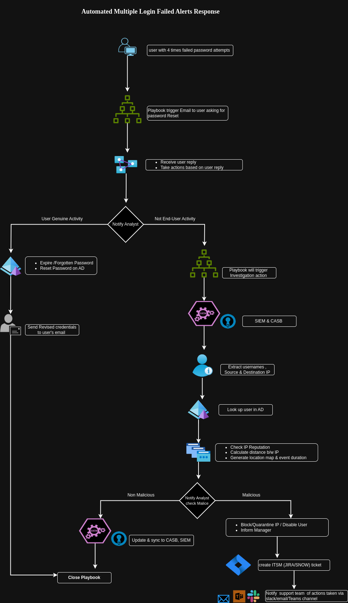

# Use Case Automate the workflow for multiple security login failure alerts response

Solution :-

&#x20;&#x20;

Architecture Diagram

Draw.io file - [file](MultipleLoginFailure.drawio)

Here we'll use SOAR (Security Orchestration Automation and Response) to automate Multiple login failure alert response. It can be achived with the both Azure Logic & Power Apps.

Steps:-

1. We'll set threshold of login failure eg- 4/5 times
2. When user account have multiple times failed password attempts,
3. Playbook will trigger an email to user asking for justification
4. Waits for the end user reply & inform analyst
5. As soon as it receives response from end user, next job will start based upon reply
6. If user confirms genuine activities then look for justification
7. In case password expired/forgotten, reset password and share revised login credentials to user over mail
8. Incase if failed password attempts are not from end user then playbook will trigger investigation action
9. Fetch Incidents details from SIEM and UEBA connectors
10. Query will run to extract usernames, Source IP, Destination IP, Assets details
11. Cross verify username with existing users list in AD (Active Directory)
12. Check IP reputation with multiple open source IP checker. ps :- It can be automated with help of API , eg if we do use VirusTotal then Virus total API can be integrated with SOAR platform ,And in case of Microsoft Azure, Microsoft Threat Intel profile could be linked up or TAXII API
13. Check distance between IP in case of multiple location jump and generate location map & event duration
14. Notify the analyst with result score
15. If activity is malicious then  IP and user, Create ITSM ticket with defined SOP severity & notify support team via email/Teams channel or slack
16. If it's non malicious then close incident with false positive justification.
17. Stop playbook
